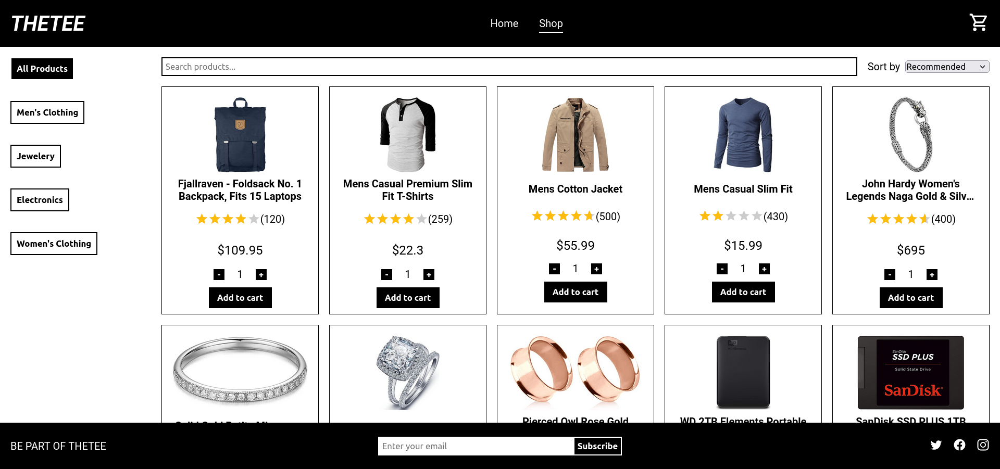

    
    <h1>Memory Game</h1>
    
Store webpage

    

        <a href="https://theteeshop.netlify.app/" target="_blank" rel="noreferrer noopener">View Demo</a> · 
        <a href="https://github.com/jotafer19/shopping-cart/issues" target="_blank" rel="noreferrer noopener">Report Bug</a> ·
        <a href="https://github.com/jotafer19/shopping-cart/issues" target="_blank" rel="noreferrer noopener"> Request Feature</a>
    

## Preview

### Features

- A webpage built using React and responsive design and with accessibility in mind.
- You can filter shop products by their category and sort them by different options: recommended, price or alphabetical order.
- Checkout page where you can add more items or remove them.

### Built With

- 
- 
- 
- 

### Tools Used

- 
- 
- 

## Outcome

- Used React to create the web app.
- Used **Git** and **GitHub** for project management, and **Netlify** to deploy it.
- Tried to maintain **clean code**.

## What I learned

- Deeper understanding of React and `useState` and `useEffect` hook.
- Dealing with **API fetching**.
- Use of **PropTypes** to verify that a piece of code is using the correct data types for variables, function parameters and return values.
- Build a Multi Page Application whit React **`Router`**.
- Use of **`CSS modules`** to style the application.
- Every component has been **tested**.

## Acknowledgments

- Inspiration by [**The Odin Project**](https://www.theodinproject.com/lessons/node-path-react-new-shopping-cart).